# latihan string
DAFTAR ISI
==========
- [LAPORAN Latihan String](#laporan-Latihan-String) 
    - [PSEUDECODE PROGRAM DATA STRING](#pseudecode-program-data-string)
    - [KESIMPULAN](#kesimpulan)

## PSEUDECODE PROGRAM DATA STRING
Berikut adalah penjelasan setiap bagian dari kode Python yang diberikan, termasuk fungsi dan cara kerjanya sebagai berikut.

### Step 1
Dalam Code Import re berfungsi Mengimpor modul re yang digunakan untuk bekerja dengan ekspresi reguler. Namun, dalam kode ini, modul re tidak digunakan dan bisa dihapus tanpa mempengaruhi fungsi program.

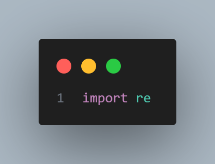

### Step 2
kemudian code Mendefinisikan fungsi validasi_form digunakan untuk menerima tiga parameter: nama, nomor_telepon, dan email. Fungsi ini bertujuan untuk memvalidasi input dari pengguna

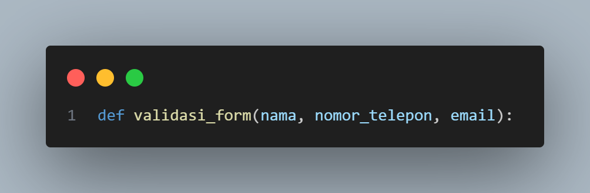

### Step 3
lalu, Inisialisasi daftar errors biasanya digunakan Membuat daftar kosong bernama errors untuk menyimpan pesan kesalahan yang mungkin ditemukan selama proses validasi.

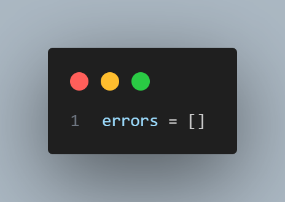

### Step 4
setelah itu ada Validasi nama berfungsi Memeriksa apakah nama hanya terdiri dari huruf (menggunakan metode isalpha()). Jika tidak, pesan kesalahan ditambahkan ke daftar errors.

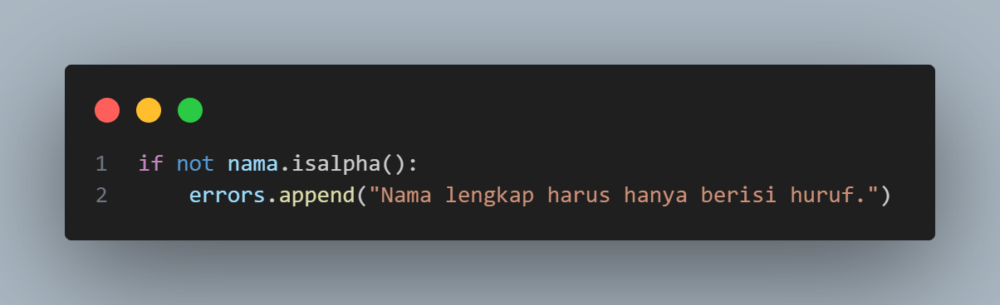

### Step 5
dalam code Validasi nomor telepon digunakan Memeriksa apakah nomor_telepon hanya terdiri dari digit (angka) menggunakan metode isdigit(). Jika tidak, pesan kesalahan ditambahkan ke daftar errors.

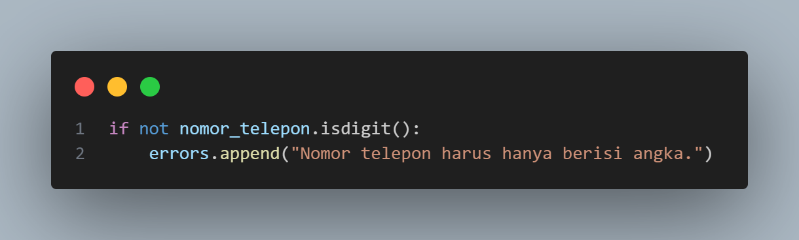

### Step 6
kemudian code Validasi email biasanya dilakukan Memeriksa apakah email mengandung karakter @ dan .. Jika salah satu dari karakter tersebut tidak ada, pesan kesalahan ditambahkan ke daftar errors.

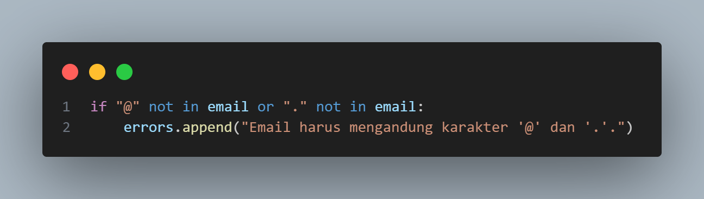

### Step 7
Dengan Menampilkan hasil validasi kita bisa mengetahui bahwa Jika ada kesalahan yang tercatat dalam daftar errors, program akan mencetak setiap pesan kesalahan. Jika tidak ada kesalahan (daftar errors kosong), program akan mencetak "Data pendaftaran valid."

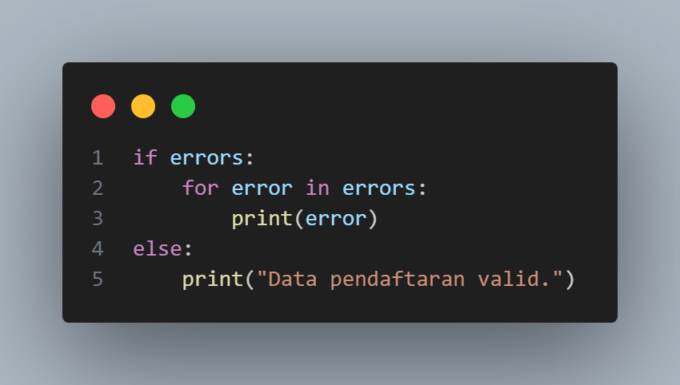

### Step 8
Setelahnya bagian Input pengguna berfungsi untuk meminta pengguna memasukkan nama, nomor_telepon, dan email. Nilai yang dimasukkan disimpan dalam variabel masing-masing.

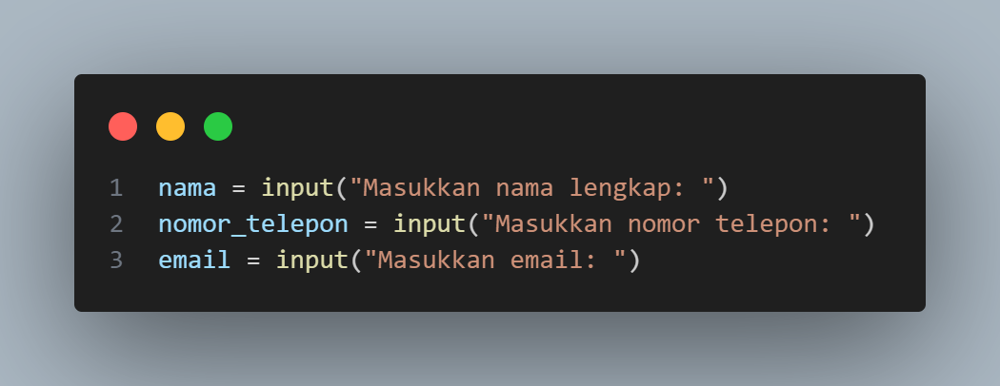

### Step 9
Kemudian Bagian Code fungsi validasi ini dilakukan Setelah pengguna memasukkan data, fungsi validasi_form dipanggil dengan argumen yang diberikan (nama, nomor telepon, dan email) untuk melakukan validasi.

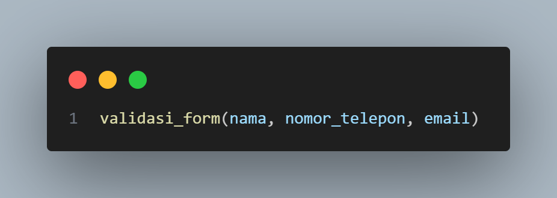

## HASIL OUTPUT PROGRAM DATA STRING
Hasil dari program ini tergantung pada input yang diberikan oleh pengguna saat diminta untuk memasukkan nama lengkap, nomor telepon, dan email. Berikut adalah kemungkinan hasil yang dapat muncul berdasarkan berbagai skenario input sebagai berikut.

### step 1 : Semua Input Valid
Dalam kasus ini, semua input memenuhi kriteria:
    - Nama hanya berisi huruf.
    - Nomor telepon hanya berisi angka.
    - Email mengandung karakter @ dan ..

# INPUT
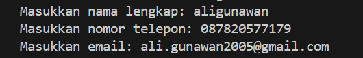

# OUTPUT

### step 2 : Nama Tidak Valid
Di sini, nama mengandung angka, sehingga validasi untuk nama gagal dan pesan kesalahan ditampilkan.

# INPUT 
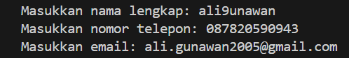

# OUTPUT
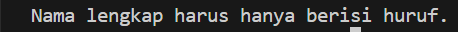

### step 3 : Nomor Telepon Tidak Valid
Dalam skenario ini, nama mengandung spasi (yang tidak valid karena isalpha() mengharuskan hanya huruf) dan nomor_telepon mengandung huruf, sehingga kedua validasi gagal.

# INPUT 
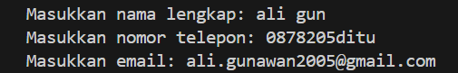

# OUTPUT
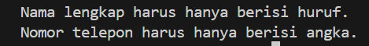

### step 4 : Email Tidak Valid
Di sini, email tidak mengandung karakter @, sehingga validasi email gagal

# INPUT 
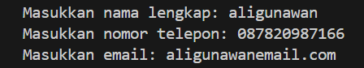

# OUTPUT
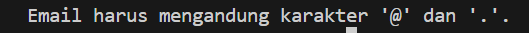

### step 5 : Semua Input Tidak Valid
Dalam skenario ini, semua input gagal validasi, sehingga semua pesan kesalahan ditampilkan.

# INPUT 
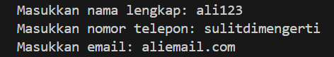

# OUTPUT
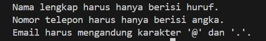

## KESIMPULAN
Program ini memberikan umpan balik yang jelas kepada pengguna mengenai apakah data yang mereka masukkan valid atau tidak. Jika ada kesalahan dalam input, program akan mencetak pesan kesalahan yang spesifik, sehingga pengguna dapat memperbaiki input mereka. Jika semua input valid, program memberikan konfirmasi bahwa data pendaftaran valid. Ini sangat berguna dalam konteks pendaftaran atau pengumpulan data, di mana validitas input sangat penting.
